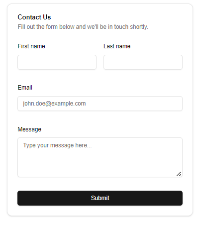

# Automated Contact Form with ShadCN and Resend

This project implements an automated contact form using Next.js, ShadCN UI components, and Resend for email automation.


## Project Overview

The main purpose of this project is to provide a simple, yet powerful contact form solution that:

1. ShadCN UI components for a clean and modern design
2. Zod for type safety and form validation
3. Resend for automated email responses

## Key Features

- Built with Next.js for optimal performance and SEO
- Styled using ShadCN CLI (v0) for consistent and customizable UI components
- Form validation to ensure data integrity
- Automated email responses to improve user experience and reduce manual workload

## Technology Stack

- Next.js
- React
- ShadCN UI (v0)
- Resend (for email automation), API Key required

## Getting Started

First, run the development server:

```bash
npm run dev
# or
yarn dev
# or
pnpm dev
# or
bun dev
```

Open [http://localhost:3000](http://localhost:3000) with your browser to see the result.

You can start editing the page by modifying `app/page.tsx`. The page auto-updates as you edit the file.

This project uses [`next/font`](https://nextjs.org/docs/app/building-your-application/optimizing/fonts) to automatically optimize and load [Geist](https://vercel.com/font), a new font family for Vercel.

## Learn More

To learn more about Next.js, take a look at the following resources:

- [Next.js Documentation](https://nextjs.org/docs) - learn about Next.js features and API.
- [Learn Next.js](https://nextjs.org/learn) - an interactive Next.js tutorial.

You can check out [the Next.js GitHub repository](https://github.com/vercel/next.js) - your feedback and contributions are welcome!

## Deploy on Vercel

The easiest way to deploy your Next.js app is to use the [Vercel Platform](https://vercel.com/new?utm_medium=default-template&filter=next.js&utm_source=create-next-app&utm_campaign=create-next-app-readme) from the creators of Next.js.

Check out our [Next.js deployment documentation](https://nextjs.org/docs/app/building-your-application/deploying) for more details.
